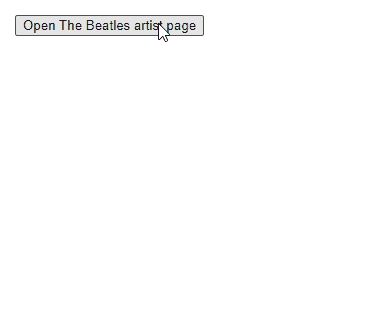
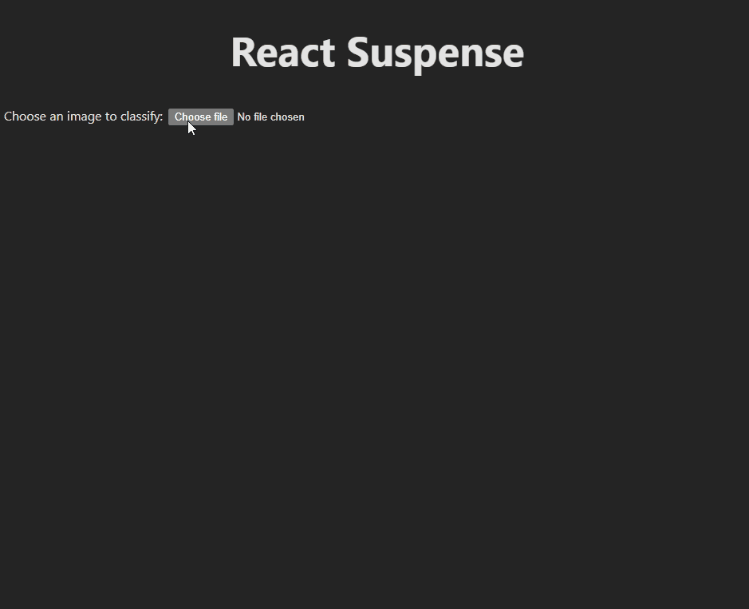
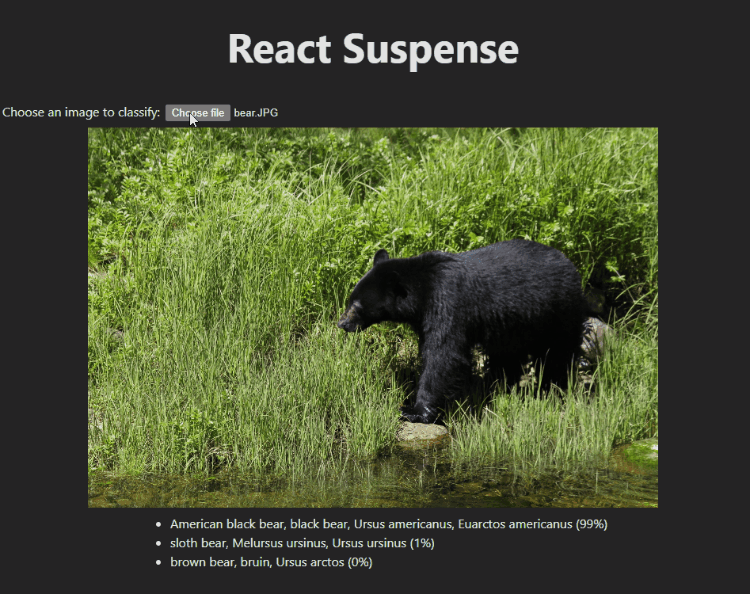
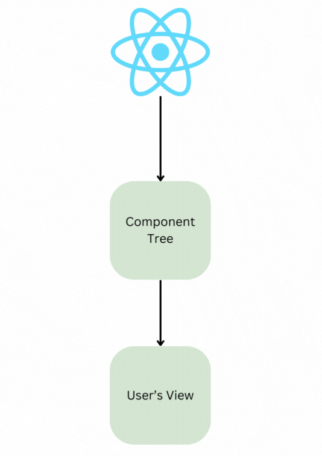

# React, Async, Suspense, and Transitions

Recently I needed to bind an asynchronous operation to React components. The existing method in the application I was working on used a HOC, but I wanted to write a hook based solution that I could use from a function component.

There's an API in React for doing that, "Suspense", which has been experimental for a long time, but was [declared "stable" in React 18](https://react.dev/blog/2022/03/29/react-v18#suspense-in-data-frameworks) (although only for data fetch within opinionated frameworks).
I thought I'd give a try.
It was unsuccessful but experience made me want to dig deeper and find out how, when, if and how I can use React Suspense in my applications.
Along the way I found transitions, another really cool bit of React API.
But also came to some uncomfortable conclusions, shaking my faith in React as a general purpose tool.

In this post I'm going to take you on that journey; deep diving into asynchrony in react, suspense and transitions.
I'll share my findings on how the API works and point you at how you might be able to use it in your applications.

All you'll need to consume this post is some React and JavaScript.
I've used a sprinkling of TypeScript where it helps, and the example application is in TypeScript, but there's nothing too obscure.

## What's it all about?

Before I get into the weeds of what suspense is and how to use it, Let's talk about the problem it's trying to solve - that is how do you handle promises in a React application?

It feels like there should be an easy answer to that, the web is asynchronous after all.
But if you stop to think, the async work you've done with a React application has probably involved some kind of framework, for example redux-thunk, react-query, rtk query or swr, and the net result of that code, is _avoiding_ asynchrony in the components themselves.

React components don't really like asynchrony and they don't play well with promises.
For example, you can't `await` inside a component, or, directly, inside hooks like `useEffect`.

This is partly because the react team view promises as side effects (which they are), and so disallow them in most circumstances, requiring pure functions.
But is also practical.
The UI has to do _something_ regardless of whether the data is ready.
You can't tell the user to sleep quietly for 500ms or until the promise resolves.
They want to know the button has been clicked or that the page is loading - you dear human are synchronous.

This causes a problem.
So how do you join the asynchronous world of the web to the synchronous world of the users?

Historically the answer has been some kind of wrapper hook that tells us the state of the `Promise`.
You'll probably have seen this kind of thing, for example; it's how
[`react-query`](https://github.com/TanStack/query/blob/2.x/docs/src/pages/docs/overview.md#enough-talk-show-me-some-code-already)
works by default, and there is a similar
[pattern commonly used with redux via thunks](https://redux.js.org/tutorials/essentials/part-5-async-logic#loading-state-for-requests).

Something like this:

```tsx
export const usePromise = (doSomethingAsync, deps) => {
  const [state, setState] = useState({ status: "pending" });
  useEffect(() => {
    (async () => {
      setState({ status: "pending" });
      try {
        const value = await doSomethingAsync();

        setState({ status: "fulfilled", value });
      } catch (error) {
        setState({ status: "rejected", error });
      }
    })();
  }, deps);
};
```

Use `useState` with an initial value something like `{ status: 'pending' }`. In `useEffect`, create, then `await` the promise.
When the promise resolves `setState` to `{ status: 'fulfilled', value }` where `value` is what the promise resolved to.
If it fails then `setState({ status: 'rejected', error: theError })`.

That lets you use an `if...else` or `switch` in your component to display some feedback to the user.

```tsx
export const AsyncComponent = () => {
  const dataState = usePromise(() => getData(), []);

  if (dataState.status === "pending") {
    return <Loading />;
  }
  if (dataState.status === "rejected") {
    throw dataState.error; // let an ErrorBoundary handle it
  }

  return <DisplayYourData data={data} />;
};
```

Here `usePromise` takes a method signature like this:

```typescript
type getData = () => Promise<Data>;
```

which we'd need to `await` to get the data, and changes it into something like this:

```typescript
type useData = () => PromiseState<Data>;
```

which is Synchronous, so when the data is available, we just have it.
We use `useState` to prompt React when the state of the promise changes and the component needs to re-render.

That works, but it doesn't sit very well.
All those conditional statements don't play well with the
[rules of hooks](https://React.dev/warnings/invalid-hook-call-warning)
for example, and the imperative style feels off when it sits next to the more declarative React APIs like `ErrorBoundary`.

It also encourages the fetch-on-render pattern which degrades User Experience.
When a user takes an action, the UI is whisked away, replaced with a loading spinner, then that too disappears to be replaced with, maybe another loading spinner as the next component down the tree renders and discovers it needs to fetch something and so on...
If your fetches are quick enough these spinners might flicker up on the screen for just long enough to disconcert.

There's been discussion on this topic for a long time.
For example I remember reading
[this post](https://legacy.Reactjs.org/blog/2019/11/06/building-great-user-experiences-with-concurrent-mode-and-suspense.html).
Generally the consensus is now to aim to fetch-while-you-render.
The user triggers an action, which causes the data to be fetched, then while the data is loading, tell React to draw the new UI.
Hopefully by the time you get there the data has loaded, maybe you don't need to show a loading spinner at all.
The application feels more polished and reassuringly professional.

That's really hard with the tools we have to hand.
But... the React team have been promising to solve those problems with `Suspense` and "Concurrent Rendering" for years and now it's arrived (kind of).

## So what is Suspense anyway?

[`Suspense`](https://React.dev/reference/React/Suspense) is a way to declaratively tell React what to do when components aren't ready to render yet.

It's been there for a long time already and you might have even used it in conjunction with
[Relay](https://relay.dev/)
or
[`lazy`](https://React.dev/reference/React/lazy).
However the API has always bee declared "experimental" with those two applications being the one ones officially supported.
With the release of React 18, it was announced as "stable".
Although, only to be integrated into
[data fetching frameworks](https://React.dev/blog/2022/03/29/React-v18#suspense-in-data-frameworks).
Still.
Maybe time to take a closer look.

Let's get into that a bit - here it is being used with `lazy`:

```tsx
import { lazy, Suspense } from "React";
import { Loading } from "./loading.js";

const SomeComponent = lazy(() => import("./some-component.js"));

export const Wrapper = () => (
  <Suspense fallback={<Loading />}>
    <SomeComponent />
  </Suspense>
);
```

`SomeComponent` is declared as "lazy", i.e. we don't want to load _the code_ for that component into the browser until we need it. The `import('./some-component.js')` in the callback passed to `lazy` is a "Dynamic import" which tools like
[Webpack](https://webpack.js.org/guides/code-splitting/#dynamic-imports)
will use to split your code bundles so you can save on the initial page load.
Have a look a at the links if you want more detail there, but the point is that callback passed into `lazy` returns a `promise` which resolves when the component is ready to be rendered.
In React parlance, `SomeComponent` "suspends" until it is ready to render.

The `Suspense` component declares what to do while we're waiting - `fallback={<Loading/>}`.
It detects that `SomeComponent` has suspended and renders the `Loading` component in it's place (probably a loading spinner).

A neat thing about `Suspense` is you can think of it as a little like a `try...catch` block.
The nearest `Suspense` component in the tree is the one that displays it's fallback, and it doesn't matter what happens in between.
For example:

```tsx
export const Wrapper = () => (
  <Suspense fallback={<OuterLoading />}>
    <SomeComponent />
    <Suspense fallback={<InnerLoading />}>
      <div>
        <SomeOtherComponent />
      </div>
    </Suspense>
  </Suspense>
);
```

If `SomeComponent` suspends then we see `OuterLoading`.
If `SomeOtherComponent` suspends then we see `InnerLoading`: working up the tree from `SomeOtherComponent`, that's the first Suspense you come to.
The `div` in between makes no difference, just as with a `try...catch` it doesn't matter how many function calls deep you go between the `try...catch` and the `throw`.
The Error bubbles back up through the call stack until it finds a catch block.
In the same way, when the promise is thrown by a component, it bubbles back up through the component tree until it finds a `Suspense`.

Hopefully that's clear, and we're left with the next question: How do I, as a component author, declare that my component has "suspended"?

Well... that's where things get curious.
If you look at the docs for
[Suspense](https://React.dev/reference/React/Suspense)
you won't find it mentioned anywhere.
So this is where we need to go sleuthing.

## Suspend

In the docs we can find
example snippets which show how to use `Suspense`.
Since these are just examples they are pretty simple, and don't use real data fetches or libraries, so a bit of digging through their code shows us the way.

You can find [this](https://codesandbox.io/s/ymcj43?file=/Albums.js) example in
[the usage section of the docs](https://React.dev/reference/React/Suspense#usage).
It doesn't do much:



Looking at the listings, bit we care about is in `Albums.js`, which contains 2 things - a component and a hook.

If you look in
[ArtistPage.js](https://codesandbox.io/s/ymcj43?file=/ArtistPage.js:165-262),
you'll see that `Albums` is wrapped in a `Suspense`.
So we're going to see a loading spinner until the data returns.

I've shown the code for Albums (the component in `albums.js`) here. It calls `use(fetchData` and then displays the result.

```tsx
export default function Albums({ artistId }) {
  const albums = use(fetchData(`/${artistId}/albums`));
  return (
    <ul>
      {albums.map((album) => (
        <li key={album.id}>
          {album.title} ({album.year})
        </li>
      ))}
    </ul>
  );
}
```

`fetchData` is pretty noddy - it mimics an AJAX call, and returns a promise of the data.
The `use()` call though, seems to have the raw data returned.
`use` has changed the `Promise<Value>` returned by `fetchData` straight to `Value` without having to `await` it.
[`use`](https://codesandbox.io/s/ymcj43?file=/Albums.js:669-1188) (the hook in `albums.js`) looks like this:

```tsx
function use(promise) {
  if (promise.status === "fulfilled") {
    return promise.value;
  } else if (promise.status === "rejected") {
    throw promise.reason;
  } else if (promise.status === "pending") {
    throw promise;
  } else {
    promise.status = "pending";
    promise.then(
      (result) => {
        promise.status = "fulfilled";
        promise.value = result;
      },
      (reason) => {
        promise.status = "rejected";
        promise.reason = reason;
      },
    );
    throw promise;
  }
}
```

If you squint at that and turn your head to the side it kind of looks like a mash-up of the `usePromise` and `AsyncComponent` I showed earlier.

Working down the the `if...else` branches you can see similar things happening, if the promise is `'fulfilled'`, the value is returned synchronously (the component will display it).
If the Promise is `'rejected'`, the `reason` (error) is thrown for an `ErrorBoundary` to catch.

Then the new bit - if the promise has a status of `'pending'` then `throw promise`
and the final branch (when there's no status on the promise), is similar; attach `'pending'` and `then` callbacks, then `throw` it.
To summarise, `use` can do one of 3 things:

1. Return the value
2. Throw an error
3. Throw the promise.

Throwing the promise turns out to be all you need to do to suspend.
If React catches a promise thrown by a rendering a component, the component is considered to have "suspended" and React falls back to the nearest `Suspense` component, `await`s the promise and finally attempts to re-render the component when the promise resolves.

## Testing the Theory

I needed a little problem to solve, and settled on a noddy app which uses one of the
[pre-trained TensorFlow.js models, `mobilenet`](https://github.com/tensorflow/tfjs-models/tree/master/mobilenet),
to classify images uploaded from the desktop.
There's no back end to worry about, but the image load and classification is asynchronous so we need to `await` it (and therefore suspend a component).
Here's a gif of it in action:



I've recorded this erroring so you can see the error boundary getting activated, but once you've shaken the grebulons out of the expector, you see the image (as soon as it's uploaded), then the classifications (once they've been calculated), with spinners in the relevant places while we're waiting.
(MobileNet is right - that's a North American black bear I snapped in Canada.)

I'm not going to talk through the whole app [the full listings are here](https://github.com/jaybeeuu/React-suspense) if you are interested.
For now let's focus on this component:

```tsx
export interface ImageClassificationsProps {
  imageClassifications: Promise<ImageClassification[]>;
}

export const ImageClassifications = ({
  imageClassifications,
}: ImageClassificationsProps): JSX.Element => {
  const resolvedClassifications = usePromise(imageClassifications);

  return (
    <ul>
      {resolvedClassifications.map((classification) => (
        <li key={classification.className}>
          {classification.className} (
          {Math.round(classification.probability * 100)}%)
        </li>
      ))}
    </ul>
  );
};
```

This is the component you see loading at the bottom of the screen that displays the classifications.
The `imageClassifications` prop is a `Promise<ImageClassification[]>` - that's the data MobileNet returns us.
Similarly to `Albums.js` the promise is passed to a hook (`usePromise`) and then data returned is displayed.
This component is wrapped in a `Suspense` component, so if it suspends we get a loading spinner.

`usePromise` is listed [here](https://github.com/jaybeeuu/React-suspense/blob/bf9ffd094ccad973fa617f38816c409c6c3aac8a/src/use-promise.ts).
(It's a TypeScript'd and refactored version of the `use` hook shown above, so I won't bother showing it here.)
If the promise passed in is **pending**, `usePromise` throws the promise, if rejected then the error is thrown, and if resolved then it synchronously returns the result.

I think this is pretty neat.
It fits really well with the way `ErrorBoundaries` work for example.
The component consuming my asynchronous data doesn't need to handle anything but the data; loading and error states are handled elsewhere in the app.
There's a downside which is that it's a little magical - It's not obvious from the signature of the hook or the component consuming it that you need to have it wrapped in a suspense layer. But we might be able to live with that.

## The Rub

This looks simple, but there's a devil in the detail.
Initially I had implemented this in what appeared to be a similar fashion to the approach taken by the React doc's example and fetched/asked MobileNet for the classifications inline in the component, with a bit of memoisation via a state hook.
But that looped infinitely.

There's an important
[caveat in the React docs](https://React.dev/reference/React/Suspense#caveats):

> React does not preserve any state for renders that got suspended before they were able to mount for the first time. When the component has loaded, React will retry rendering the suspended tree from scratch.

So every time my promise resolved, React re-rendered `ImageClassifications` _from scratch_, defeating my memoisation and creating a new Promise instance, which then was put into pending and suspended...

Looking back at the example in the docs they cheat (well... it is an example). The promises `fetchData` makes are cached for the lifetime of the app in a module level `Map` you can see it in
[data.js](https://codesandbox.io/s/ymcj43?file=/data.js:170-193).

So that gives us a rule to keep in mind when we make components suspend.
You must manage your promises outside of React.

That makes things a little more complicated. For example now we need to build a something which let's us manage that somewhere, effectively some kind of cache.
It's not impossible, but certainly harder than just writing a hook.
We need to have a good caching strategy, key selection, how often to refresh, how do you know when to free up memory etc.

That's a hard enough problem to solve well that it might be why the React team have recommended that we use `Suspense` through libraries and haven't publicised the "suspend" end of the API.

In trying to solve that problem mentally I think I'm converging on something like
[`react-query`](https://tanstack.com/query/latest)
that I mentioned earlier.
It allows you to create a "query" with an arbitrary async function, and call it within your component,
and as of v5 of `react-query`, includes
[first class suspense support](https://tanstack.com/blog/announcing-tanstack-query-v5#1st-class-suspense-support).
So long as your "key" is stable, it will take care of everything else.
In my experience though this library is opinionated in a lot of things,
and hard to bend it to my use cases... further experimentation is needed perhaps.

Still - with some effort, an import or combinations thereof,
we have some way to integrate asynchronous operations in to React applications, and it leaves the application code clean and completely unaware of the asynchrony.
So that's nice.

## The Next Step

There was another part of the React 18 announcement that went along with the suspense "release".
That's the
["Transitions"](https://React.dev/blog/2022/03/29/React-v18#new-feature-transitions)
part. And it's the bit that allows us to create, smoother, much more pleasant user experiences.

This is pretty neat.
Essentially, wrap the change that will cause a component to suspend, and you're UI isn't whisked away.
It remains until the new tree is ready to render, and you get an opportunity to render some alternative state if you wish.

Check this out:



We start where we left off - we've just loaded and classified the bear image, then select a new image
(a
[Pacific White-Sided Dolphin](https://en.wikipedia.org/wiki/Pacific_white-sided_dolphin)).

This time though, when the open file dialogue closes, we still see the bear.
There's a little loading spinner added up top, and the choose file button has been disabled to let you know it's up to something.
Then after a little delay we get the image and the classifications all on one go.
(MobileNet is confused this time, but, to be fair; pacific white-sided dolphins do bear a passing resemblance to orca and I'll bet weren't in the training data.)

That's a big difference from the original user flow. Must be a lot of very complex code right? Not a bit - it's the exactly the same.

What's happened?

The trick is in the
[`onChange` on the file input in `App`](https://github.com/jaybeeuu/React-suspense/blob/main/src/app/App.tsx#L20-L30):

```tsx
export const App = (): JSX.Element => {
  const [file, setFile] = useState<File | null>();
  const [isPending, startTransition] = useTransition();

  return (
    <>
      <header className={styles.header}>
        <h1>React Suspense</h1>
      </header>

      <main className={styles.main}>
        <label>
          Choose an image to classify:
          <input
            disabled={isPending}
            type="file"
            onChange={(e) => {
              startTransition(() => {
                void getMobileNet(); // get MobileNet loading, but don't wait for it.
                setFile(e.currentTarget.files?.item(0));
              });
            }}
            accept="image/*"
          />
          {isPending ? <LoadingSpinner size={"small"} /> : null}
        </label>
        {file ? <ImageLoader file={file} /> : null}
      </main>
    </>
  );
};
```

The state change that causes the app to load a new the image in is `setFile(e.currentTarget.files?.item(0))` (see the `useState` call up top.).
You'll notice that that is wrapped in a call to `startTransition` which, in turn, comes from a hook -
[`useTransition`](https://React.dev/reference/React/useTransition).

`startTransition` marks the state change for React, so it knows we're about to change the UI in some way.
Rather than change what the user sees immediately, React copies the tree, passes the new state into the copy (in our case `file` goes into `ImageLoader`, which triggers (without waiting) the file load and classification), then starts rendering the components.
All the while, React continues to maintain the original UI in the DOM; passing us back `true` on `isPending` so we can let the user know something is happening.

Only when the new tree is ready will React actually commit it to the UI and change what the user sees, in our case once the image has loaded and the classifications have returned.

That looks something like this:



This is concurrent rendering in action - React's own version of multi-universe theory.
Can you imagine trying to do that without using suspense?
I've tried; it's hard.

## Conclusions

I feel that suspense is a powerful feature, and will unlock a lot of cool things we can do with React, especially when used in conjunction with `useTransition`. I'm sure it could help us in building awesome UX.

However, I'm left wondering if the team haven't gone a bit too far
[down the rabbit hole here](https://overReacted.io/algebraic-effects-for-the-rest-of-us/),
and done something that was a bit too clever for it's own good.
Sometimes, if it's hard to use, it's because you're doing it wrong.
While I'm not averse to using a library where it makes sense, async data fetches are something every app does at some point, and handling them feels like something React should make easy out of the box.
To me at least, suspense doesn't seem like it's done that.

This feels like a bad sign.
To make use of suspense, we're at the mercy of the opinions and target solutions of frameworks and libraries in the ecosystem.
Fine... so long as you agree with those opinions, and are doing something the frameworks had in mind, but that is constraining, and doesn't work in all cases.
It used to be that you could eject at some point, and lean on the primitives that React exposed to make something that worked for you... no longer.
Does this mean React is no longer a good choice?
Maybe I just need to look deeper into the ecosystem, I'm not sure, but it's a thing to think about.
