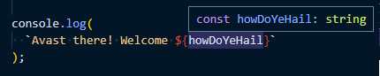

# Shiver Me Template Literals

A little while ago I wrote a post about
[template literal types](../template-literal-types/template-literal-types.md),
really cool feature of TypeScript.

I discovered some other, related, features the other day when I was poking around with
[Yargs](http://yargs.js.org/).

In real life I do a bit of cabinet making and carpentry.
THere are times when the job you have at hand needs the right tool, and without it...

These types are tools you want in your box.

## Yargs

So lets start with [Yargs](http://yargs.js.org/).
This library is fantastic.
It allow you to built command line interfaces (CLI's) for node applications.
If you haven't tried it you should.

There's a lot of things that Yargs can do,
but For this story the important feature is that you define the arguments for you're app in code.
For example:

```ts
import yargs from "yargs/yargs";

const { howDoYeHail } = await yargs(process.argv.slice(2))
  .option("how-do-ye-hail", {
    alias: "h",
    demandOption: true,
    describe: "What should I call you?",
    type: "string",
  })
  .help()
  .parse();

console.log(`Avast there! Welcome ${howDoYeHail}`);
```

OK this thing parses a single argument from `process.argv`; `how-do-you-hail`.
The `parse` function returns the promise of an object which contains the parsed arguments.

Call the script like this...

```sh
ts-node yargs-example.ts --how-do-you-hail "Long John Silver"
```

You can imagine what you get back.

There's some magic happening here though.
See how `howDoYeHail` is destructured off the result of the promise?
Yargs give us the arguments as `camelCase` even though I told it the name of the argument in `kebab-case`.

That's neat, but it's not the magic...
The magic is that TypeScript is happy about that.
It knows that `howDoYeHail` is a `string`...



But I only told it `kebab-case`... Is it psychic? TypeScript can't break open a string and infer that type can it?

## The Types

Cue digging into the types in `@types/yargs`.
What I discovered was a really
[neat piece of work](https://github.com/DefinitelyTyped/DefinitelyTyped/blame/6ddc77f6f1f08aeeee508a03d5f1fb1db27dc9d1/types/yargs/index.d.ts#L813),
showcasing some built-in types I didn't know existed:

```ts
/** Convert literal string types like 'foo-bar' to 'FooBar' */
type PascalCase<S extends string> = string extends S
  ? string
  : S extends `${infer T}-${infer U}`
    ? `${Capitalize<T>}${PascalCase<U>}`
    : Capitalize<S>;

/** Convert literal string types like 'foo-bar' to 'fooBar' */
type CamelCase<S extends string> = string extends S
  ? string
  : S extends `${infer T}-${infer U}`
    ? `${T}${PascalCase<U>}`
    : S;
```

The entry point for us is `CamelCase`.
You use it something like this: `CamelCase<"kebab-case">`,
The result is a type like this: `kebabCase`.

Neat.
How does it work?

So the beginning is a conditional type.
If the type `S` is just a `string` type
(`string extends S`)
then return `S`,
Otherwise test it against a template literal type.
If `S` has a dash in it
(`S extends ${infer T}-${infer U}`)
then
(having labelled the left and right hand words of it as `T` and `U` (`infer`))
drop the `-` and join `T` to `PascalCase<U>` `${T}${PascalCase<U>}`, otherwise `S` again.

RIght we've arrived at `PascalCase`.
That has a similar shape.

Again just return `string`
(`string extends S ? string`)
otherwise check if we have a dash again
(`S extends ${infer T}-${infer U}`)
If it doesn't then capitalize `S` (`Captialize<S>`, we'll get to that),
This type is recursive - this is the base case.
Otherwise capitalize the first word (`T`) and recurse on the second (`U`), so if there's more-than-one-dash,
they all get removed and the words capitalized,
making it PascalCase
(`${Capitalize<T>}${PascalCase<U>}`).

OK so we've one missing piece.
`Capitalize`.
That must be where the grunt work happens?
I went to definition on that. but... it's Intrinsic.

There turn out to be 4
[intrinsic string manipulation types](https://www.typescriptlang.org/docs/handbook/2/template-literal-types.html#intrinsic-string-manipulation-types).
Uppercase, Lowercase, Capitalize and Uncapitalize.
I'm not sure what I'm going to do with them yet,
but I'm sure they're going to be exactly what I need some day.
It's always handy to have some magic up your sleeve.
