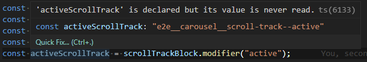

Template literals are a fantastic feature of JavaScript
(well a few languages, but I find myself thinking mostly about JavaScript at the moment).
They make building up strings terse and legible.

I like using them so much what when I saw that
[Version 4.1](https://devblogs.microsoft.com/typescript/announcing-typescript-4-1/#template-literal-types)
of TypeScript added a way of defining type definitions with them i got a bit excited.

As with so many shiny features though
(like tagged templates still need to find and excuse to use those...)
I had to wait until I found the right use case.
But finally I found one: BEM naming conventions!
Let's hve a look at them in the context of a real use case.

## What are template literals?

Fair question.
[Template literals](https://developer.mozilla.org/en-US/docs/Web/JavaScript/Reference/Template_literals)
in JavaScript are use to build up strings using variables.
They were introduced in ES2015.
In the bad old days you would have to do something like this:

```js
const action = "eat";
const fruit = "pear";

const sentence = "I would like to " + action + " a "
  + fruit + ".";

console.log(sentence); // Logs "I would like to eat a pear".
```

That's awkward.
It's a pain to write and a pain the read.
What about with template literals?

```js
const action = "eat";
const fruit = "pear";

const sentence = `I would like to ${action} a ${fruit}.`;

console.log(sentence); // Logs "I would like to eat a pear".
```

We have the same result but it's much more natural to read that no?
It's more concise and there's less noise.

## Template Literal Types

If we switch to TypeScript then what is the type of our sentence?
It's a `string`.

That's a shame.
TypeScript knows what `action` and `fruit` are (`"eat"` and `"pear"` respectively since they are constants).
So it could infer that the type of `sentence` is `"I would like to eat a pear."`.
After all it too is a constant and it's made up of constants.

Well... since TypeScript 4.1 it does have that type (in 4.2 or higher you must also use `as const`):

```ts
const sentence = `I would like to ${action} a ${fruit}.` as const;
```

`sentence` now has the type `"I would like to eat a pear."`

Neat.

Can we use that to define a type?

Yes!

```ts
type Action = "eat";
type Fruit = "pear";

type Instruction = `${Action} a ${Fruit}`;
```

Instruction will have the type `"eat a pear"`;
Fun right?

Yeah fun, but it's not obvious to me yet why I should care.

## Lets see a use case

The use case I found was to create a set of functions which define
CSS class names using the BEM naming convention.

That's a lot of words.
Let me explain.

On my current project we separate out the concerns of styling our components (we are using react)
and selecting elements to assert on or interact with in our UI end to end (E2E) tests (we use Cypress).
So rather than using css classes to apply both styles and select elements in E2E.
We add classes to style our elements (style classes) and *also* add different classes for use in E2E (E2E Hooks).
This is good.
We are free to restyle our elements or refactor the classes we apply without breaking our tests.
Tests that don't need to change as a result of refactors bring most _value_.

The problem is that we need to have unique class names because CSS classes are globally scoped.
For Our style classes we use CSS modules (which are fantastic) but that would be awkward as E2E hooks,
since they don't exist in style sheets.

So instead we revert to an old tactic for scoping CSS classes.

## BEM

[BEM](http://getbem.com/naming/)
is a naming convention defines a series of rule for giving your classes names to avoid naming collisions
and improving readability.

BEM stands for Block Element Modifier.
I don't want to get too deep but understanding this is important to see why the use case works.
THe idea is that your classes will be made up of combinations of those three things.

Blocks are top level containers; "a standalone entity that is meaningful on its own".
For example you might have a "Carousel" a block.

Elements are use to build up the Block.
For example our carousel might have images or dot buttons to select the images.

Finally Modifiers are roughly "states" of the elements or blocks.
Maybe a carousel's scroll is animating or the one of the dot buttons is active to indicate that is the current image.

To make up a CSS class using these we join them with various delimiters:

```css
.carousel__scroll-track--active {
  color: grey;
}

.carousel__scroll-track--active {
  color: grey;
}
```

In this example the class indicates the `carousel` block's `scroll-track` which is currently in `active` state.
The segments are joined with `__` to indicate an element, and `--` to indicate a modifier.

The rules are simple, but pretty effective.

## BEM Prefixer

Manually building up those class names is a hassle.
And I'm lazy so I use a set of functions to build them:

```js
export const makeHookBlock = (block) => {
  const blockClass = `e2e__${block}`;

  const getBlock = () => {
    return blockClass;
  };

  getBlock.element = (element) => {
    return `${blockClass}__${element}`;
  };

  getBlock.modifiedElement = (element, modifier) => {
    return `${blockClass}__${element}--${modifier}}`;
  };

  getBlock.modifier = (modifier) => {
    return `${blockClass}--${modifier}` as const;
  };

  return getBlock;
};
```

OK so hopefully you can see what's happening here:
Fisrt we make a class (`blockClass`).
(It doesn't have a `.` because it's going on the the class attribute of a DOM element.)
It combines `"e2e"` with the `block` argument.
That's only really so we can see the classes that are e2e hooks at a glance.

We make a `getBlock` function which will be returned as our block.
Then attach a couple of functions to it.
`element` simply combines an argument with `blockClass` using the `__` that indicates an element.
`modifier` the same with the `--` of a modifier.

Here's the thing being used;:

```jsx
import classNames from 'classnames';

const carouselBlock = makeHookBlock("carousel");
const scrollTrack = carouselBlock.element("scroll-track");
const activeScrollTrack = carouselBlock.modifiedElement(
  "scroll-track",
  "active"
);

const ScrollTrack = ({ active, onClick }) => (
  <button
    className={classNames(
      scrollTrack,
      { active: activeScrollTrack }
    )}
    onClick={onClick}
  />
);
```

`scrollTrack` ends up being `"e2e__carousel__scroll-track"`,
`activeScrollTrack`, `"e2e__carousel__scroll-track--active"`.

A bit more expressive than manually typing it out right?
(In fact rather than `modifiedElement` we have a `makeChildElement` function that returns another decorated function,
but that's a bit more involved than we need for this post.)

## Typings

Alright now we have the use case lets see the typings.
Here's a first pass at the return type for `makeHookBlock`:

```ts
interface HookBlock {
  () => string;
  element: (element: string) => string;
  modifiedElement: (element: string, modifier: string) => string;
  modifier: (modifier: string) => string;
}

const makeHookBlock = (block: string): HookBlock => {
  // ...
};
```

OK that works fine, but where you are using the result you only see `string` for the type.
So if you share these classes or define them in one module and use them in another,
your don't necessarily know what your getting.
That's not great because it could slow down the debug cycle.
I'm all about creating a better developer experience so can we do better?

Lets have a go with template literal types.

```ts
interface HookBlock<Block extends string> {

  () => Block;

  element: <Element extends string>(
    element: Element
  ) => `${Block}__${Element}`;

  modifiedElement: <
    Element extends string,
    Modifier extends string
  >(
    element: Element,
    modifier: Modifier
  ) => `${Block}__${Element}--${Modifier}`;

  modifier: <Modifier extends string>(
    modifier: Modifier
  ) => `${Block}--${Modifier}`;
}

const makeHookBlock = <Block extends string>(
  block: Block
): HookBlock<Block> => {
  // ...
};
```

(Apologies - apparently  `highlightjs` doesn't know what generics are.)

Pretty cool no?
OK it's a bit verbose.
But I think it's cool.

Essentially we use generics to pass through the segments of the eventual class.
Then Template Literal Types too join them together.

Now you don't have to do the mental gymnastics to figure out what the actual hook text is TypeScript has your back.
Just hover over it in the IDE with your mouse.



Fan. tas. tic.
