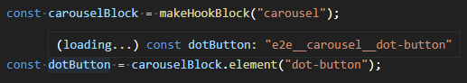

# Template Literals

[Template literals](https://developer.mozilla.org/en-US/docs/Web/JavaScript/Reference/Template_literals)
are a fantastic feature of JavaScript
(well a few languages, but I find myself thinking mostly about JavaScript at the moment).
They make building up strings terse and legible.

I like using them so much what when I saw that
[Version 4.1](https://devblogs.microsoft.com/typescript/announcing-typescript-4-1/#template-literal-types)
of TypeScript added a way of defining type definitions with a similar syntax I got a bit excited.

As with so many shiny features though
(like tagged templates still need to find and excuse to use those...)
I had to wait until I found the right use case.
But finally I found one: BEM naming conventions!
Let's have a look at them in the context of a real use case.

Today I'm going to talk through what template literal types are and how they helped.

## What are template literals?

Fair question.
[Template literals](https://developer.mozilla.org/en-US/docs/Web/JavaScript/Reference/Template_literals)
in JavaScript are use to build up strings using variables.
They were introduced in ES2015.
In the bad old days you would have to do something like this:

```js
const action = "eat";
const fruit = "pear";

const sentence = "I would like to " + action + " a "
  + fruit + ".";

console.log(sentence); // Logs "I would like to eat a pear".
```

That's awkward.
It's a pain to write and a pain the read.
What about with template literals?

```js
const action = "eat";
const fruit = "pear";

const sentence = `I would like to ${action} a ${fruit}.`;

console.log(sentence); // Logs "I would like to eat a pear".
```

We have the same result but it's much more natural to read that no?
It's more concise and there's less noise.

## Template Literal Types

If we switch to TypeScript then what is the type of our sentence?
It's a `string`.

That's a shame.
TypeScript knows what `action` and `fruit` are (`"eat"` and `"pear"` respectively since they are constants).
So it could infer that the type of `sentence` is `"I would like to eat a pear."`.
After all it too is a constant and it's made up of constants.

Well... since TypeScript 4.1 it does have that type (in 4.2 or higher you must also use `as const`):

```ts
const sentence = `I would like to ${action} a ${fruit}.` as const;
```

`sentence` now has the type `"I would like to eat a pear."`

Neat.

Can we use that to define a type?

Yes!

```ts
type Action = "eat";
type Fruit = "pear";

type Instruction = `${Action} a ${Fruit}`;
```

Instruction will have the string literal type `"eat a pear"`;
Fun right?

Yeah fun, but it's not obvious to me yet why I should care.

## What's the use?

Like I said,
it took me a while to find ~~an excuse~~ a reason to use these types.
The use case I found was to create a set of functions which define
CSS class names,
for use as end to end (E2E) test hooks,
using the BEM naming convention.

That's a lot of words.
Let me explain.

I like to separate out the concerns of styling my components (I use react at the moment)
and selecting elements to assert on or interact with in my UI end to end (E2E) tests (I use Cypress).
So rather than using CSS classes to apply both styles and select elements in E2E,
I add classes to style our elements (style classes) and *also* add different classes for use in E2E (E2E Hooks),
when I need them.
If you inspect a couple of elements on this blog (try the buttons in the navbar/header) you'll see them;
they are the classes that start `e2e__`.

This is good.
I am free to restyle components or elements or refactor the classes I apply without breaking my tests.
Tests that don't need to change as a result of refactors bring more *value*.

The problem is that we need to have unique class names because CSS classes are globally scoped.
For style classes I use CSS modules (which are fantastic) but that would be awkward as E2E hooks,
since the hooks,
by definition,
don't exist in style sheets.

So instead I revert to an old tactic for scoping CSS classes.

## BEM

[BEM](http://getbem.com/naming/)
is a naming convention defines a series of rule for giving your classes names to avoid naming collisions
and improving readability.

I don't want to get too deep but understanding BEM a little is important to grokking the use case.

BEM stands for Block Element Modifier.
The idea is that your CSS classes will be made up of combinations of those three things.
This does a couple of things.
For one it's *a* convention, so naming becomes more consistent.
Also it give you some concept of scoping and so helps to avoid the global CSS classes problem.

Blocks are top level containers; "a stand alone entity that is meaningful on its own".
For example you might have an image carousel letting you display a sequence of images on your site.
The root CSS style of that might then be the "carousel" block.

Elements are sub components of the Block.
For example our carousel might have images or
a series of dot-buttons to select the images/show which is active.

Finally Modifiers are roughly "states" of the elements or blocks.
Maybe a carousel's images are animating in and out of sight
or the one of the dot buttons is active to indicate that is the current image.

To make up a CSS class using these we join them with various delimiters:

```css
.carousel__dot-button {
  color: grey;
}

.carousel__dot-button--active {
  color: white;
}
```

In this example the class indicates the `carousel` block's `dot-button` element which is currently in `active` state.
The segments are joined with `__` to indicate an element, and `--` to indicate a modifier.

The rules are simple, but pretty effective at manually scoping the classes.

## BEM Builder

Manually building up those class names is a hassle.
And I'm lazy so I use a set of functions to build them.
OK I'm being flippant here.
There's better reasons to take this next step.

* It's easier to discover BEM syntax is being used if you have words describing it, rather than just the classes and
(you document your teams working practices and conventions right?) some wiki page somewhere.
* It's more likely those who follow after will use your naming convention if it's easy.
  Encoding how to do it in code,
  then publicising and documenting it makes it pretty difficult to do anything but follow the pattern.

Here we go...

```js
const makeHookBlock = (block) => {
  const blockClass = `e2e__${block}`;

  const getBlock = () => {
    return blockClass;
  };

  getBlock.element = (element) => {
    return `${blockClass}__${element}`;
  };

  getBlock.modifiedElement = (element, modifier) => {
    return `${blockClass}__${element}--${modifier}}`;
  };

  getBlock.modifier = (modifier) => {
    return `${blockClass}--${modifier}` as const;
  };

  return getBlock;
};
```

OK so hopefully you can see what's happening here:
First we make a class (`blockClass`), which is the class at the root of our block.
(It doesn't have a `.` because it's going on the the class attribute of a DOM element,
not as a selector.)
The `"e2e"` prefix is only really so we can see the classes that are E2E hooks at a glance,
and ensure (for example in review) that they don't end up in style sheets.

We make a `getBlock` function which will be returned as our block.
Then attach a couple of other functions to it.
`element` simply combines an argument with `blockClass` using the `__` that indicates an element.
`modifier` the same with the `--` of a modifier.

Here's the thing being used:

```jsx
import classNames from "classnames";
import { makeHookBlock } from "@jaybeeuu/e2e-hooks";

const carouselBlock = makeHookBlock("carousel");
const dotButton = carouselBlock.element("dot-button");

const activeDotButton = carouselBlock.modifiedElement(
  "dot-button",
  "active"
);

const dotButton = ({ active, onClick }) => (
  <button
    className={classNames(
      dotButton,
      { active: activeDotButton }
    )}
    onClick={onClick}
  />
);
```

`dotButton` ends up being `"e2e__carousel__dot-button"`,
`activeDotButton`, `"e2e__carousel__dot-button--active"`.

A bit more expressive than manually typing it out right?
(In fact rather than `modifiedElement` we have a `makeChildElement` function that returns another decorated function,
but that's a bit more involved than we need for this post.)

The problem, though is that while the code is more accessible to the uninitiated
(they don't need to learn how to make a BEM element, they can call a function).
What you actually end up with is not obvious, and that could slow things down.
What if, for example, you want to manually check a hook has appeared on an element?
You have to know what to expect.
Which means going back to the definitions, now hidden behind layers of code.

With JavaScript you don't get much help.
Even jumping to the definition is hit and miss depending on your IDE/editor & the context of the call.
So from that point of view maybe we would have been better leaving the strings - the functions are mystifying things.

Fortunately, JavaScript is not the only tool in our box.
As far as I am concerned one TypeScript's key selling points is that it's great at making code self-documenting.

With TS you get back all the tools like intellisense and
code navigation that you come to expect if you work with strongly typed languages like Java or C#.
It's difficult to overstate how much time you save when autocomplete tells you which params you need for a function,
compared to having to track down the definition or docs.

Can TypeScript help us out of this hole and improve the DevX (developer experience) of my helpers too?
(Spoiler alert the answer is yes.
which... you probably figured out given that I bothered writing this post...)

## Typings

Here's a first pass at the return type for `makeHookBlock`:

```ts
interface HookBlock {
  (): string;
  element: (element: string) => string;
  modifiedElement: (element: string, modifier: string) => string;
  modifier: (modifier: string) => string;
}

const makeHookBlock = (block: string): HookBlock => {
  // ...the same implementation as before.
};
```

OK that works fine, but where you are using the hooks you only see `string` for the type.
So you still don't know what your getting.
Can we do better?

Lets have a go with template literal types:

```ts
type Hook<Block extends string> = `e2e__${Block}`

interface HookBlock<Block extends string> {
  (): Hook<Block>;

  element: <Element extends string>(
    element: Element
  ) => `${Hook<Block>}__${Element}`;

  modifiedElement: <
    Element extends string,
    Modifier extends string
  >(
    element: Element,
    modifier: Modifier
  ) => `${Hook<Block>}__${Element}--${Modifier}`;

  modifier: <Modifier extends string>(
    modifier: Modifier
  ) => `${Hook<Block>}--${Modifier}`;
}

const makeHookBlock = <Block extends string>(
  block: Block
): HookBlock<Block> => {
  // ...
};
```

Essentially we use generics to pass through the segments of the eventual CSS class,
then Template Literal Types too join them together.

Pretty cool no?
OK it's a bit verbose.
But I think it's cool and importantly that verbosity doesn't carry through to the calls.
So it doesn't impact the DevX of the helpers.
Type inference means that when we use it all the generics go away and it ends up nice and clean
(just like before).

Here's an example usage:

```ts
const carouselBlock = makeHookBlock("carousel");
const dotButton = carouselBlock.element("dot-button");

const activeDotButton = carouselBlock.modifiedElement(
  "dot-button",
  "active"
);
```

Let's look at the `element` call as an example.
The type for that function is:

```ts
element: <Element extends string>(
  element: Element
) => `${Hook<Block>}__${Element}`;
```

The `Element` generic type is the value we pass into the function - it's the bit that will end up after the `__`.
In the example  here it's type will be a string literal: `"dot-button"`
(not just `string`).

`Hook<Block>` is the root class for your hook block.
It gets figured out when you `makeHookBlock`, and it will be another string literal type.
This one is made up of the `"e2e__"` prefix, and the `Block`, which is what you called `makeHookBlock` with.
So in this example `Hook<Block>` will be `"e2e_carousel"`.

The return type of the `element` function is the final piece of the puzzle.
It sticks those two components together using a `"__"`.
The final result then is `"e2e__carousel__dot-button"`.

If that seems daunting it's worth remembering that
type inference means you won't need to use the generics when you call the function.
Great! the API stays nice and clean, the only difference is the types.

Just hover over it in the IDE with your mouse:



Now you don't have to do the mental gymnastics, or code navigation,
to figure out what the actual hook is; TypeScript has your back.

Fan. tas. tic.
